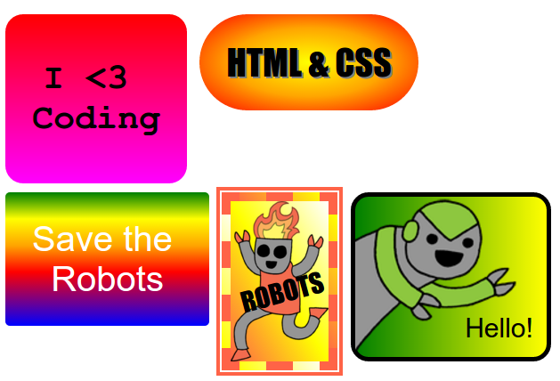

## What you will make

Create fun stickers you can use to decorate web pages. 

--- print-only ---

--- /print-only ---

--- no-print ---

<iframe src="https://editor.raspberrypi.org/en/embed/viewer/stickers-complete" width="100%" height="500" frameborder="0" marginwidth="0" marginheight="0" allowfullscreen> </iframe>

--- /no-print ---
