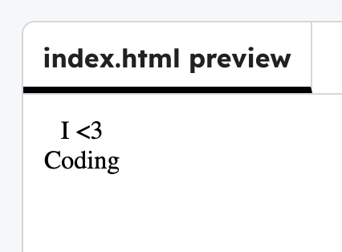

<h2 class="c-project-heading--task">Add your first sticker</h2>

### Step 1

Make an 'I <3 Coding' sticker. 

Add a new sticker in the `index.html`.

--- code ---
---
language: html
filename: index.html
line_numbers: true
line_number_start: 7
line_highlights: 9
---
<body>

  
I <3   Coding

</body>
--- /code ---

### Step 2

**Run** your code. Try adding your own text.

