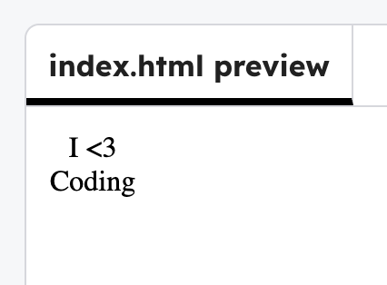

## Add your first sticker

Make an 'I <3 Coding' sticker.

Add a new sticker in the `index.html`.

```html filename="index.html" line_numbers="true" line_number_start="7" line_highlights="9"
<body>

  <div class="sticker" id="coding">I &lt;3 <br> Coding</div>

</body>
```

Try adding your own text.

## Now run your code

Run your code and check that your first sticker appears with the text you added.


