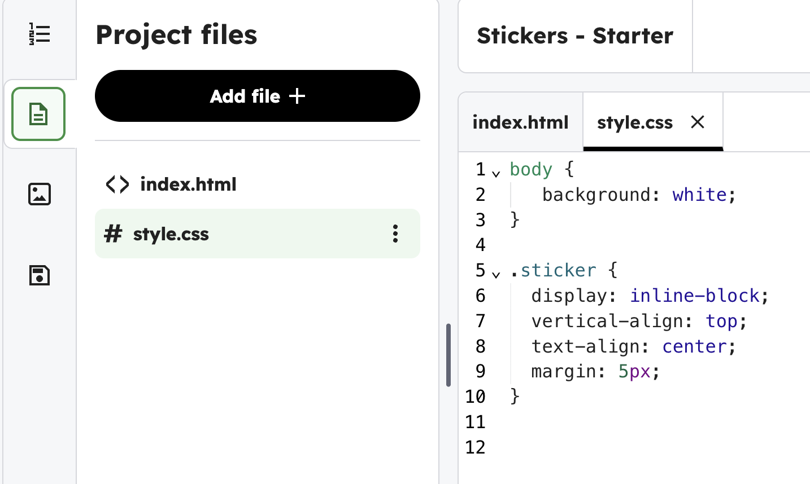
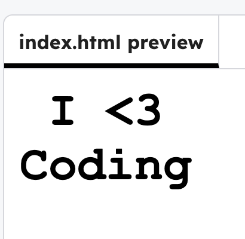

<h2 class="c-project-heading--task">Style the text</h2>

### Step 1

Use CSS to style the text for your sticker.

### Step 2

Click on the file icon, and the `style.css` file.

### Step 3

Add the CSS code below to style the text that uses the id `coding`.

### Tip

An `id` is added to HTML, and used in the CSS so the styles are changed in the right place.

### Step 4

Experiment with the font. You could try changing the `font-family` to: 
- `Impact`
- `Comic Sans MS`
- `Trebuchet MS`. 

You can also change the font-weight and the font-size.

--- code ---
---
language: css
filename: style.css
line_numbers: true
line_number_start: 5
line_highlights: 11-17
---
.sticker {
  display: inline-block;
  vertical-align: top;
  margin: 5px;
}

#coding {
  font-size: 40px;
  font-weight: bold;
  color: black;
  font-family: "Courier New";
  text-align: center;
}
--- /code ---

### Step 5

**Run** your code. See how it has changed the style.

