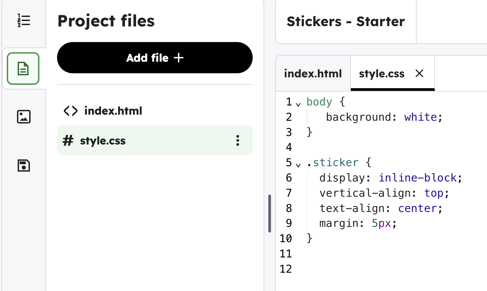
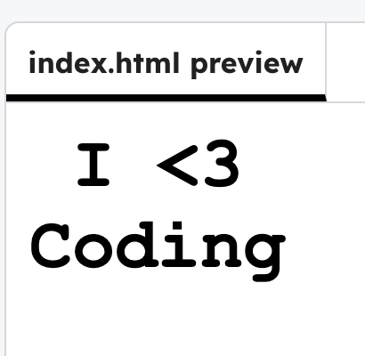

## Style the text

Use CSS to style the text for your sticker.

## Step 1

Click on the file icon, and the `style.css` file.



## Step 2

Add the CSS code below to style the text that uses the id `coding`.

> [!TIP]
>
> An `id` is added to HTML, and used in the CSS, to change the styles in the right places.

```css filename="style.css" line_numbers="true" line_number_start="5" line_highlights="11-17"
.sticker {
  display: inline-block;
  vertical-align: top;
  margin: 5px;
}

#coding {
  font-size: 40px;
  font-weight: bold;
  color: black;
  font-family: "Courier New";
  text-align: center;
}
```

## Step 3

Experiment with the font. You could try changing the `font-family` to: 
- `Impact`
- `Comic Sans MS`
- `Trebuchet MS` 

You can also change the font-weight and the font-size.

## Now run your code

Run your code and check that the `I <3 Coding` sticker has the new text style.


