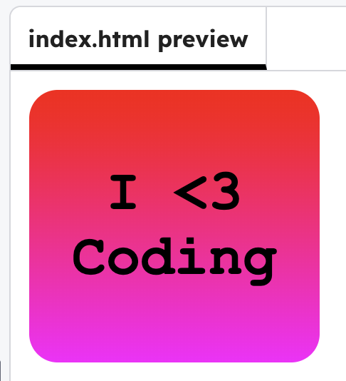

<h2 class="c-project-heading--task">Style the background</h2>

Add to how the sticker looks with a gradient background and padding.

<h2 class="c-project-heading--explainer">Follow these instructions</h2>

## Step 1

Add to the CSS with the code below.

## Step 2

Try replacing `red` and `magenta` with other options. You can find more CSS colours [here](http://jumpto.cc/colours){:target="_blank"}.

## Step 3

Experiment with `padding` and `border-radius` to change how the sticker looks.

--- code ---
---
language: css
filename: style.css
line_numbers: true
line_number_start: 12
line_highlights: 18-20
---
#coding {
  font-size: 40px;
  font-weight: bold;
  color: black;
  font-family: Courier New;
  text-align: center;
  background: linear-gradient(red, magenta);
  padding: 50px 30px;
  border-radius: 20px;
}
--- /code ---

## Step 4

**Run** your code. See how it has changed the style.

## Now run your code

Confirm the observable result.
