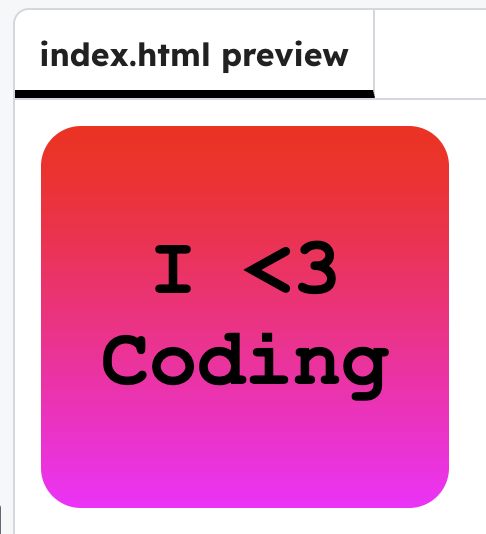

## Style the background

Make the sticker look nicer with a gradient background and padding.

## Step 1

Add to the CSS with the code below.

```css filename="style.css" line_numbers="true" line_number_start="12" line_highlights="18-20"
#coding {
  font-size: 40px;
  font-weight: bold;
  color: black;
  font-family: Courier New;
  text-align: center;
  background: linear-gradient(red, magenta);
  padding: 50px 30px;
  border-radius: 20px;
}
```

## Step 2

Try replacing `red` and `magenta` with other options. You can find more CSS colours [here](http://jumpto.cc/colours){:target="_blank"}.

## Step 3

Experiment with `padding` and `border-radius` to change how the sticker looks.

## Now run your code

Run your code and check that the sticker has a colourful background and rounded corners.


