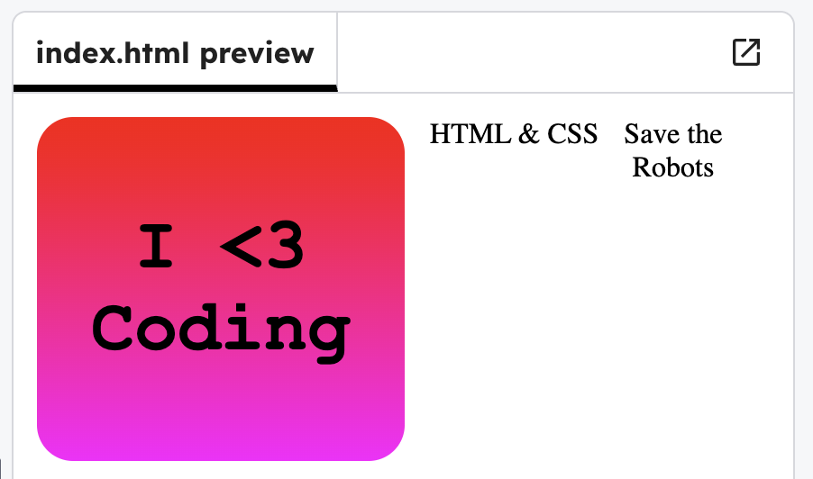

## Add more stickers

Add two more sticker messages to your page.

In `index.html`, add some more stickers with the code below. 

```html filename="index.html" line_numbers="true" line_number_start="7" line_highlights="10-11"
  <body>

    <div class="sticker" id="coding">I &lt;3 <br> Coding</div>
    <div class="sticker" id="web">HTML &amp; CSS</div>
    <div class="sticker" id="save">Save the <br>Robots</div>
  
  </body>
```

## Now run your code

Click **Run** and check that the two new sticker texts appear.


