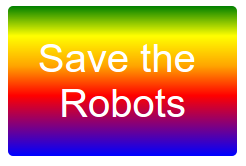

--- challenge ---

### Create your own gradient

--- task ---

Add a `
` with your sticker text to `index.html` and give it the `sticker` class and a new `id`.

--- /task ---

--- task ---

In `style.css`, add styling for the `id` you chose. You could copy one of the sticker styles you have already made and edit that.

--- /task ---

There’s a list of all the colour names you can use: [jumpto.cc/web-colours](http://jumpto.cc/web-colours), which includes colour names like `tomato`, `firebrick` and `peachpuff`.

If you want to change the text colour you can use `color:`.

Here’s an example of what you can do with multiple colours in a linear gradient:

--- /challenge ---

--- challenge ---

### Make more stickers

--- task ---

Make more stickers using different gradient directions and adding images and text and using borders and outlines. 

--- /task ---

**Tip**: You'll need to add HTML and CSS for each sticker. 

You can copy and edit one of your examples and make changes to create a new sticker. 

Your project already includes a set of robot images. Click on the images icon to see the available images. 

--- /challenge ---