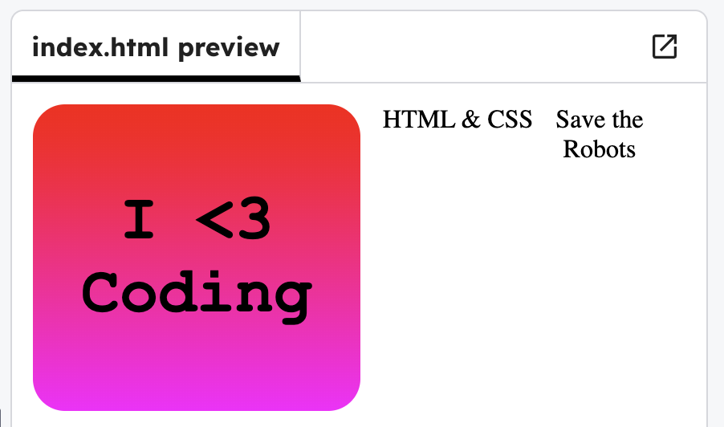

<h2 class="c-project-heading--task">Add more stickers</h2>

--- task ---

Add two more sticker messages to your page.

--- /task ---

--- task ---

In `index.html`, add some more stickers with the code below. 

--- /task ---

--- code ---
---
language: html
filename: index.html
line_numbers: true
line_number_start: 7
line_highlights: 10,12
---
  <body>

    
I <3   Coding

    
HTML & CSS

    
Save the  Robots

  </body>
--- /code ---

--- task ---

**Test:** Click **Run**. You should see your two new text.

--- /task ---

