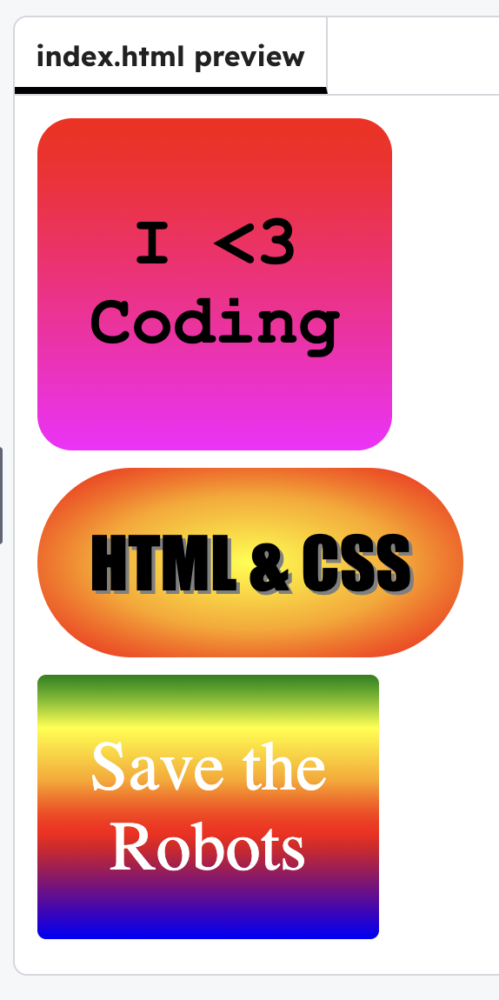

<h2 class="c-project-heading--task">Style the new stickers</h2>

--- task ---

Use gradients, shadows, and padding to style your new stickers.

--- /task ---

--- task ---

In **style.css** add styles for `#web` and `#save`. Experiment with the CSS until you are happy with the look.

--- /task ---

--- code ---
---
language: css
filename: style.css
line_numbers: true
line_number_start: 12
line_highlights: 23-30, 32-39
---
#coding {
  font-size: 40px;
  font-weight: bold;
  color: black;
  font-family: Courier New;
  background: linear-gradient(red, magenta);
  padding: 50px 30px;
  border-radius: 20px;
  text-align: center;
}

#web {
  font-size: 40px;
  font-family: Impact;
  text-shadow: 2px 2px grey;
  background: radial-gradient(yellow, orange, red);
  padding: 30px;
  border-radius: 100px;
}

#save {
  font-size: 40px;
  color: white;
  background: linear-gradient(green, yellow, orange, red, purple, blue);
  padding: 30px;
  border-radius: 5px;
  text-align: center;
}
--- /code ---

--- task ---

**Test:** Click **Run** to see the styles change.

--- /task ---

