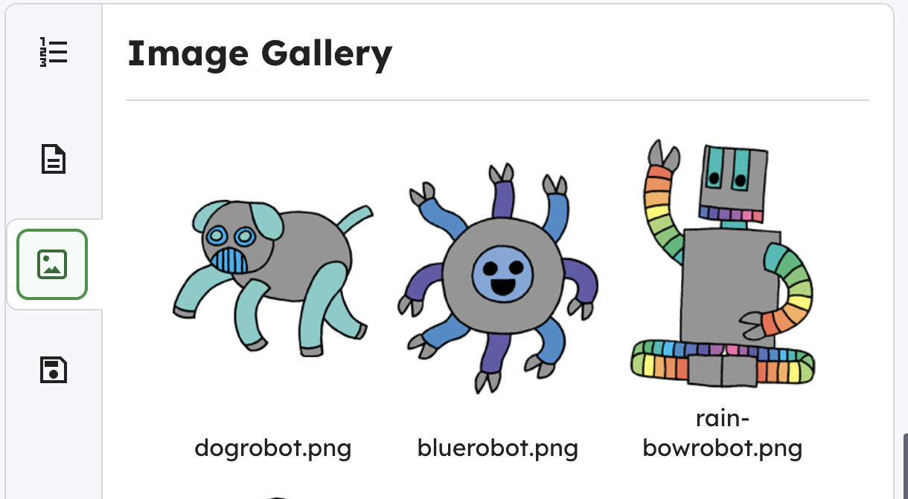

<h2 class="c-project-heading--task">Add an image sticker</h2>

Make some new stickers with robot images.

### Step 1

Choose an image from the pictures tab.

{:style=“width:50%;“}

### Step 2

In `index.html`, add the code below.

--- code ---
---
language: html
filename: index.html
line_numbers: true
line_number_start: 9
line_highlights: 13-15
---
    
I &lt;3   Coding

    
HTML &amp; CSS

    
Save the  Robots

    

      
    

  </body>
--- /code ---

### Step 3

**Test:** Click **Run** to see the styles change.

