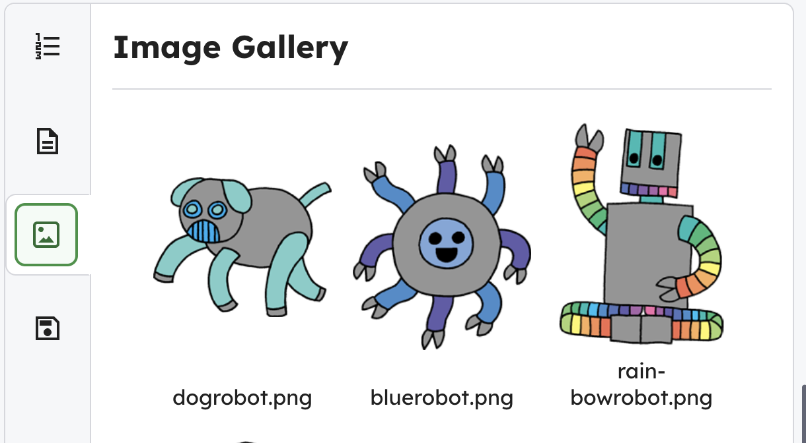
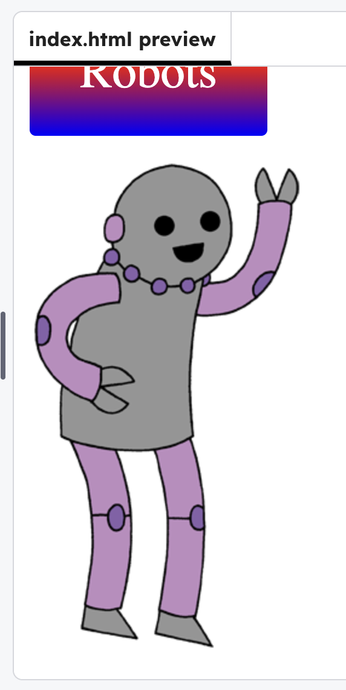

## Add an image sticker

Make some new stickers with robot images.

## Step 1

Choose an image from the pictures tab.

{:style="width:50%;"}

## Step 2

In `index.html`, add the code below.

```html filename="index.html" line_numbers="true" line_number_start="9" line_highlights="13-15"
    <div class="sticker" id="coding">I &lt;3 <br> Coding</div>
    <div class="sticker" id="web">HTML &amp; CSS</div>
    <div class="sticker" id="save">Save the <br>Robots</div>

    <div class="sticker" id="purplerobot">
      
    </div>

  </body>
```

## Now run your code

Click **Run** and check that the robot image you picked appears as a new sticker.


