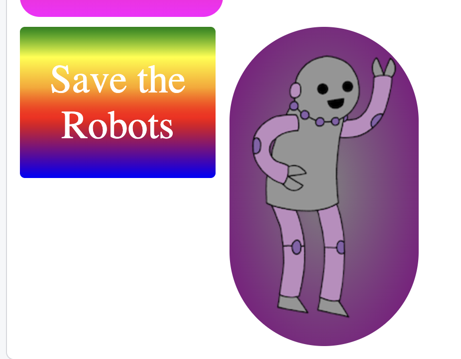

<h2 class="c-project-heading--task">Style the image sticker</h2>

In **style.css** add styles for `#purplerobot`.

<h2 class="c-project-heading--explainer">Follow these instructions</h2>

Add backgrounds and rounded corners behind your robot images.

--- code ---
---
language: css
filename: style.css
line_numbers: true
line_number_start: 32
line_highlights: 41-45
---
#save {
  font-size: 40px;
  color: white;
  background: linear-gradient(green, yellow, orange, red, purple, blue);
  padding: 30px;
  border-radius: 5px;
  text-align: center;
}

#purplerobot {
  background: radial-gradient(gray, purple);
  padding: 20px;
  border-radius: 150px;
}
--- /code ---

## Now run your code

Click **Run** and check that the purple robot sticker now has its own background and rounded shape.
