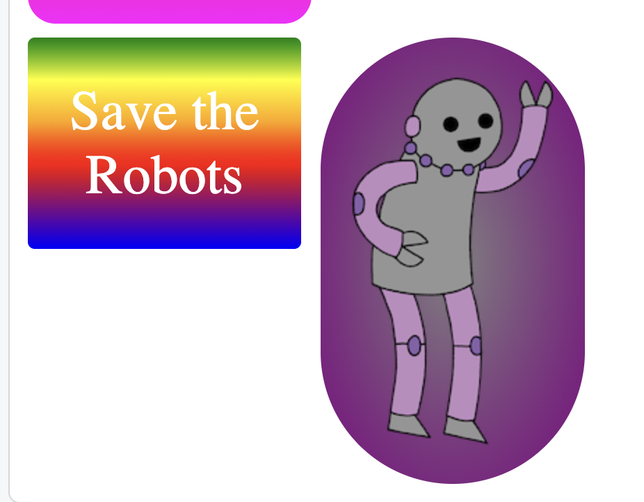

## Style the image sticker

In **style.css** add styles for the robot you have chosen. This example uses `#purplerobot`.

Add backgrounds and rounded corners behind your robot images.

```css filename="style.css" line_numbers="true" line_number_start="32" line_highlights="41-45"
#save {
  font-size: 40px;
  color: white;
  background: linear-gradient(green, yellow, orange, red, purple, blue);
  padding: 30px;
  border-radius: 5px;
  text-align: center;
}

#purplerobot {
  background: radial-gradient(gray, purple);
  padding: 20px;
  border-radius: 150px;
}
```

## Now run your code

Click **Run** and check that the purple robot sticker now has its own background and rounded shape.


