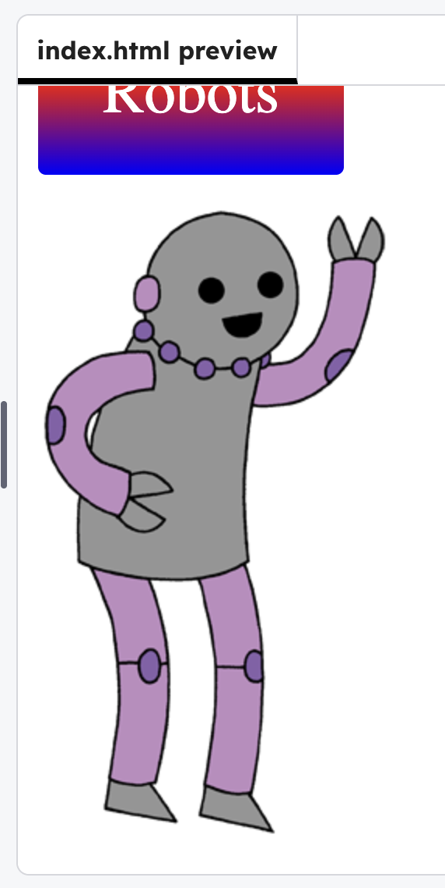

<h2 class="c-project-heading--task">Style the image sticker</h2>

--- task ---

In **style.css** add styles for `#purplerobot`. Add backgrounds and rounded corners behind your robot images.

--- /task ---

--- code ---
---
language: css
filename: style.css
line_numbers: true
line_number_start: 32
line_highlights: 40-44
---
#save {
  font-size: 40px;
  color: white;
  background: linear-gradient(green, yellow, orange, red, purple, blue);
  padding: 30px;
  border-radius: 5px;
  text-align: center;
}

#purplerobot {
  background: radial-gradient(gray, purple);
  padding: 15px;
  border-radius: 150px;
}
--- /code ---
--- task ---

**Test:** Click **Run** to see the styles change.

--- /task ---

body {
   background: white;
}

.sticker {
  display: inline-block;
  vertical-align: top;
  text-align: center;
  margin: 5px;
}

#coding {
  font-size: 40px;
  font-weight: bold;
  color: black;
  font-family: "Courier New";
  text-align: center;
  background: linear-gradient(red, magenta);
  padding: 50px 30px;
  border-radius: 20px;
}

#web {
  font-size: 40px;
  font-family: Impact;
  text-shadow: 2px 2px grey;
  background: radial-gradient(yellow, orange, red);
  padding: 30px;
  border-radius: 100px;
}

#save {
  font-size: 40px;
  color: white;
  background: linear-gradient(green, yellow, orange, red, purple, blue);
  padding: 30px;
  border-radius: 5px;
  text-align: center;
}

#purplerobot {
  background: radial-gradient(gray, purple);
  padding: 15px;
  border-radius: 150px;
}

<html>
  <head>
    <link rel="stylesheet" href="style.css">
    
  </head>
  
  <body>

    
I <3   Coding

    
HTML & CSS

    
Save the  Robots

    
    

      
    

    
  </body>
  
</html>
