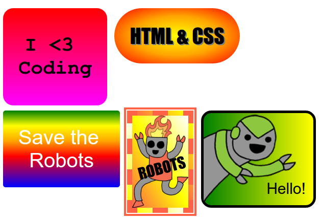

## Challenges

Make more stickers! Use different gradient directions, add images and text, and try different borders and outlines.

> [!CHALLENGE]
>
> ## Change the gradient direction
>
> Edit your gradients to run in different directions.
>
> You can use `to` to change the direction. For example: `to top`, `to left`, or `to right`. For a diagonal gradient, you give two directions. This example uses `to bottom left`.
>
> ```css filename="style.css"
>
> background: linear-gradient(to bottom left, white, yellow, tomato);
>
> ```

> [!CHALLENGE]
>
> ## Make outlines
>
> This uses `outline` to create another border outside the usual one.
> `outline-offset` gives the gap between the border and the outline.
>
> ```css filename="style.css"
> outline: 4px solid tomato;
> outline-offset: 2px;
>
> ```

> [!CHALLENGE]
>
> ## Rotate
>
> Rotate text or images by using `transform: rotate` in your CSS.
>
> ```css filename="style.css"
> transform: rotate(-15deg);
> ```

## Now run your code

Run your code and check that your stickers rotate or change in the way you styled them.

Here are some examples of sticker experiments.


